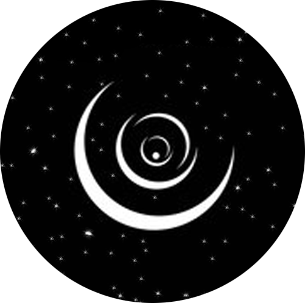

# Dream Capture Website

<br />
<div align="center">
    
  <h3 align="center">Dream Capture</h3>
  <p align="center">
    "Capture your dream, discover yourself."
  </p>
</div>

---

<details>
  <summary>Table of Contents</summary>
  <ol>
    <li><a href="#About-the-project">About The Project</a></li>
    <li><a href="#tech-stack">Tech Stack</a></li>
    <li><a href="#installation">Installation</a></li>
    <li>
      <a href="#installation">Getting Started</a>
      <ul>
        <li><a href="#prerequisites">Prerequisites</a></li>
        <li><a href="#steps">Steps</a></li>
      </ul>
    </li>
    <li><a href="#usage">Usage</a></li>
    <li><a href="#license">License</a></li>
    <li><a href="#contact">Contact</a></li>
  </ol>
</details>

---

## About the project

Dream Capture is a web platform designed to help users capture their dreams and discover themselves. By providing tools for recording, organizing, and exploring dreams, it fosters self-discovery and personal growth.

---

## Features

- **User Registration & Authentication**  
  Secure login and sign-up functionality with role-based access.

- **Dream Management**  
  Full CRUD (Create, Read, Update, Delete) operations for dream entries.

- **Explore Page**  
  Search, filter, and paginate through public dreams shared by users.

- **Profile Management**  
  Users can customize their profiles and view their dream history.

- **Dark Mode**  
  Toggle between light and dark themes for a personalized experience.

- **Responsive Design**  
  Web pages render well on a variety of devices and window or screen sizes from minimum to maximum display size


---

## Tech Stack

- **Frontend**  
  - HTML, CSS, JavaScript  
  - React.js  

- **Backend**  
  - Node.js with Express.js  

- **Database**  
  - MongoDB  

---

## Installation

### Prerequisites

- Node.js (v16 or higher)  
- MongoDB (local or cloud instance)

### Steps

- Clone the repository:

```bash
git clone https://github.com/C13-AhmadElFerayhat/MERAKI_Academy_Project_4.git
```

- Navigate to the project directory:

```bash
cd Dream Capture
```
- Install dependencies:

```bash
npm install
```

- Create a .env file in the root directory and configure the following:

```makefile
PORT=5000
MONGO_URI=your_mongodb_connection_string
JWT_SECRET=your_jwt_secret
```

- Start the backend server:

```bash
npm run dev
```

- Start the forntend:

```bash
npm run dev
```
## Usage

- Register a new account or log in to an existing one.

- Start creating dream entries and explore dreams shared by others.

- Customize your profile and manage your dream history.
  
---

## Contact

<p>For inquiries or feedback, feel free to reach out:</p>
<p>Ahmad Elferayhat</p>

[](https://ca.linkedin.com/in/ahmad-elferayhat)
[](mailto:a.elferayhat@gmail.com)
